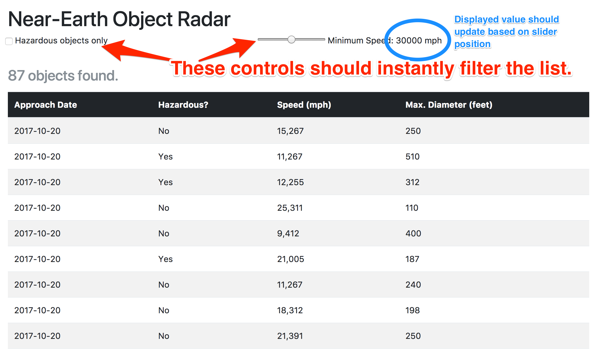

# Homework #2

**Due Date:  Thursday, Nov. 2**

### 1. Getting Started

* Do not fork this repository.  Instead, download a zip file so that you can create your own, private repository. Add `rkillackey` as a collaborator.
* Take a look at the `index.html` mockup.
* Commit early and often.
* Push to your repository often so that we can easily help if you get stuck.

### 2. Requirements

Given the NASA API we used in class:

`https://api.nasa.gov/neo/rest/v1/feed?start_date=2017-10-12&api_key=ThEWyjBBPDnDKV2CVSqO4gRU3qjBlpkMJo06rwo8`

Build a single-page application (SPA) that meets the following requirements:

1. [10 pts] Show a list of all expected NEOs over the next 7 days.
2. [4 pts] Let the user select "Hazardous Only" checkbox to filter the list
3. [4 pts] Let the user filter by minimum incoming speed (0 - 60,000 mph in increments of 1000).  The default setting should be 0.
3. [2 pts] Highlight hazardous objects in the list when the "Hazardous Only" checkbox is not selected.  (When the "Hazardous Only" checkbox is selected, do not highlight them, since all rows already indicate hazardous objects.)

Important Notes/Requirements:

* You must [get your own API key from NASA](https://api.nasa.gov/api.html).  Do not use the `api_key` value used in the example URL above.
* Your grade is partly based on your code clarity and demonstrated proficiency in your chosen framework.
* Become familiar with the way NASA documents their APIs: https://api.nasa.gov/index.html.  Our specific API is [documented here](https://api.nasa.gov/api.html#NeoWS).
* You may use plain JavaScript, jQuery, or React.
* Be sure to use the proper date in your API query, not the hardcoded URL given above.
* I've provided an HTML mockup page to get you started, but feel free
to innovate further.

### 3. Annotated Mockup

<kbd>

</kbd>
